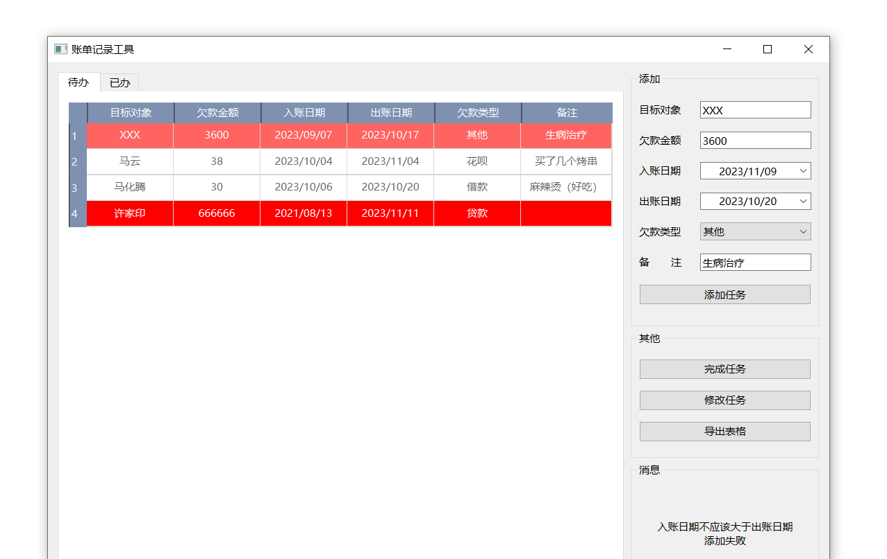

## 简介

一个简单的账单管理系统

### 特点：

主要管理自己的欠账还款信息，界面使用 qt 绘制，目前没有联网功能，只能本地使用记录，主要是给自家用的

### 功能：

- 添加任务
- 完成任务
- 修改任务
- 按照日期或者金额排序排序
- 导出为 excel 表格
- 还款日期三天以内则标浅红
- 还款金额在 10 万以上且还款日期位于一月之内标深红

### 后续计划：

- 添加微信接口，临近日期通过 pushlus 公众号发送提醒
- 添加网络备份功能，将数据保存到云端实现多端同步

## 推荐修改

- bill.ui：直接使用 qt designer 拖拽绘制自己想要的界面，修改欠款类型
- updateTodo.ui：同上
- task.py： tableAdd 函数，修改还款日期以及还款金额的提醒线
- task_list.py： 修改\_\_init\_\_函数，设置数据存储位置，默认是用户目录的 **WineAndBill** 目录下
